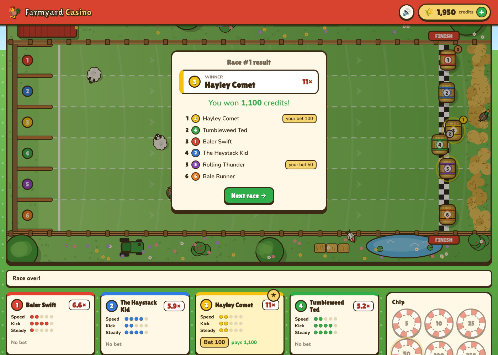

# Farmyard Rally 🚜🌾

A cartoon farm game for phones (and desktop browsers). Race your tractor, earn credits, upgrade
it, and race again. Credits are free in-game currency with no cash value.


## Games

### Tractor Rally (main game)
A single-screen, top-down off-road race in the style of the classic arcade *Super Off Road*: four
tractors on a dirt track ringed with hay bales and tyres, with jumps, mud, water splashes and
bumps.

- **Controls (phone):** put your thumb anywhere on the left half of the screen and slide left
  or right to steer at a steady rate (sliding further doesn't turn harder). Hold your thumb
  still for a moment and it's just like lifting it: the turn stops, the tractor keeps the
  direction it's pointing and the slider re-centres under your thumb.
  Gas is automatic. **NITRO** and **BRAKE** (hold to reverse) sit bottom-right. Play in landscape.
- **Two camera views**, switchable any time with the 📷 camera button at the top of the race screen, the **V**
  key, or the pause menu (the choice is remembered):
  - **Whole track** — the classic single-screen *Super Off Road* view.
  - **Close-up** — a *Micro Machines*-style camera that follows your tractor with a little
    look-ahead and fills the whole screen, with edge arrows pointing to off-screen rivals and a
    minimap of the track.
- **Controls (keyboard):** ← → steer, ↓ brake/reverse, Space nitro, Esc pause.
- **Pause → Controls** explains the controls for the device you're playing on (phone or
  keyboard), with a link to the other set.
- **Cash bags and nitro cans** pop up on the track. Grab them before the other tractors do.
- **Prizes:** credits for your finishing place plus any cash bags you grabbed.
- **The garage:** spend credits on four upgrades, 5 levels each, and choose a paint job:
  - **Acceleration** — get up to speed faster
  - **Top Speed** — go faster flat out
  - **Handling** — tighter turns and more grip
  - **Boosts** — one more nitro per race
- **Fair rivals:** on the first track rival tractors run at about 91% of a stock tractor's pace
  (they drive cleaner lines than a thumb can), rising to full pace by the Grand Prix. A little
  **rubber banding** helps only the player: fall more than ~140px behind the tractor directly
  ahead and you get up to +16% speed, fading out as you close back up behind it. It never
  helps you pass anyone.
- **Ten tracks**, unlocked in order by finishing 3rd or better on the one before: Muddy Meadow,
  Barnyard Bend, Pig Pen Pass, Duck Pond Dash, Cornfield Chase, Sheep Dip Slalom, Haystack Hill,
  Windmill Way, Orchard Run and the Harvest Grand Prix. Rivals get faster and prizes get bigger
  (300 → 1,400 credits for a win) as you go, and rivals also scale a little with your upgrades.
- **Bonus track 11: Figure-8 Frenzy** — a figure of eight with a real crossroads in the middle
  where tractors cross paths (and can T-bone each other). Unlocks after a top-3 finish at the
  Harvest Grand Prix.
- **Unlock all tracks (testing):** a switch under the track list in the garage opens every track
  regardless of results; switch it off to go back to normal unlocks.

- **Awards:** finish 1st, 2nd or 3rd for a 🥇🥈🥉 trophy on that track. Set the quickest lap of
  the race for the ⏱️ **Fastest Lap** award and a bonus (a tenth of the track's winning prize).
  Personal-best laps are recorded per track, and the HUD shows your current and best lap. Tap
  the 🏆 counter in the garage to open the **Trophy Cabinet**: totals plus, for every track, your
  best finish, trophy counts, fastest-lap awards and best lap.

### Install on an iPhone
Open the page in Safari, tap **Share → Add to Home Screen**. It then launches full screen in
landscape like an app, with its own icon. (A native App Store build would mean wrapping this web
app with something like Capacitor; that's a later step.)

### Hay Bale Derby (earn credits)
Six round hay bales roll down a hillside, seen from above. Back the bale you think will cross the
finish line first. Chickens, ducks, sheep, pigs and cows wander across the course at random and
bounce, slow down or divert any bale that hits them — the heavier the animal, the bigger the knock.

- **Odds** are priced fresh for every race by simulating the field 300 times (Monte Carlo) and
  applying a 10% house edge, so every bale returns roughly 90% on average. Odds range from ~1.5× to 60×.
- **Bale stats** (Speed, Kick, Steady) are shown on each card and genuinely drive the physics.
- The live race uses a seed drawn only when you press *Roll 'em!*, so the outcome can't be known
  while betting.
- Bets are win-only: payout = stake × odds, rounded down.



### Piggy Bank Slots (earn credits)
Three reels, one payline. 🐷 is wild. Three truffles pay 300×, three pigs 120×, eggs 40×,
apples 16×, corn 8×, carrots 4×, and any two carrots 2×. The paytable is tuned by exact
enumeration of every reel position: about 92% return, with a win on roughly 1 spin in 4.
Bets 5–100; Space spins on a keyboard.

### Egg Roulette (earn credits)
A hen runs round 13 nests (golden 0 plus 1–12, brown or white) and lays an egg in one. Bet on a
single nest (12×), a coop of four (3×), or brown/white, odd/even, 1–6/7–12 (2×). Every bet
returns 12/13 ≈ 92.3%. Bets stay on the board between rounds, with Undo and Clear.

Both mini games decide the result before the animation and save any payout first, so closing
the page mid-spin or mid-run still pays out the next time you open the game.

## Currencies, ads and the store
- **🌾 Hay** — the game currency, shared by every game. **Hay is never sold.** You get it from a
  500 welcome gift, a 200 daily bonus (resets at local midnight), opt-in reward ads (150 each,
  up to 10 a day), and winnings. After a race with prize money you can watch an ad to double it.
- **🪙 Gold** — bought with real money, spent on premium paint jobs (60–200 Gold). Gold can't be
  bet or turned into Hay, which keeps real money away from the casino-style games.
- **Remove ads** — a one-off purchase that hides the home page banner. Reward ads stay
  available because they're always the player's choice.
- **Ads:** one banner pinned to the bottom of the **home page only** — never in a game, the
  garage or a race — and opt-in reward videos that pay only if watched to the end.

Everything runs behind adapters so going live doesn't touch game code:
- `js/monetize/ads.js` — `FarmAds.setProvider({ showBanner, hideBanner, showRewarded })`. The
  built-in provider shows labelled placeholders (a house-ad banner and a 5-second "ad" with a
  Close-without-reward button). For the App Store build, wrap the app with Capacitor and back
  this with AdMob (`@capacitor-community/admob`), including Apple's App Tracking Transparency
  prompt before personalised ads.
- `js/monetize/store.js` — purchases go through a `billing` adapter. The default is **test
  mode**: it asks for confirmation and grants the item without taking money (clearly labelled
  in the wallet). Replace it with Apple in-app purchases (e.g. RevenueCat or
  `cordova-plugin-purchase`) using the product ids in `PRODUCTS`; Apple requires IAP for
  digital goods.
- `js/monetize/rewards.js` — welcome, daily and ad-reward rules and caps.

For testing, add `?dev` to the URL to show a developer Hay top-up in the wallet.

## Wallet
Click the 🌾 pill in the top bar for free Hay (daily bonus, reward ads) and recent activity, or
the 🪙 pill to jump to the Gold store. Balances, purchases and history are stored in
`localStorage` in your browser.

Bets are taken from the wallet when the race starts. If you leave the page or reload mid-race, the
race is replayed from its seed and settled, so a bet is never lost or left hanging.

## Playing on your phone (GitHub Pages)
`.github/workflows/pages.yml` publishes the game on every push (after the tests pass) to
**https://jamesjjenkins-git.github.io/hay-roller/**. One-off setup:
1. The repo must be public on a free GitHub plan (Settings → General → Danger Zone → Change
   visibility), or you need GitHub Pro for Pages on a private repo.
2. Settings → Pages → Build and deployment → Source: **GitHub Actions**.
3. Actions tab → *Deploy to GitHub Pages* → **Run workflow** (or just push).

Then on the iPhone open the link in Safari → Share → **Add to Home Screen**.

**Updates:** each deploy stamps a build id onto every script/stylesheet URL (so phones never
mix old cached files with new ones) and writes `version.json`. The app checks it when opened or
brought back to the foreground; if a newer build is live it shows *"New version available — tap
to update"* (never during a race). The home page footer shows the running version and has a
**Check for updates** link.

## Running it
No build step and no dependencies. Either open `index.html` directly in a browser, or serve the
folder:

```sh
npm start        # serves on http://localhost:8080
```

## Tests
```sh
npm test         # Node 20+; covers the wallet, rewards, store, all three credit games and Tractor Rally
```

## Code layout
| File | Purpose |
| --- | --- |
| `js/wallet.js` | Play-money wallet (deposit / spend / credit / history), persisted to localStorage |
| `js/rng.js` | Seeded PRNG so races are reproducible |
| `js/race-sim.js` | Pure, deterministic race physics, animal AI, collisions, odds and payouts |
| `js/race-render.js` | Canvas renderer: farm scenery, bales, animals, particles |
| `js/hay-derby.js` | Betting flow, race loop, results, crash recovery |
| `js/sound.js` | Synthesized sound effects (WebAudio) |
| `js/app.js` | Lobby, wallet modal, routing |
| `js/monetize/rewards.js` | Welcome gift, daily bonus, reward-ad payouts and daily cap |
| `js/monetize/store.js` | Gold packs and Remove ads; billing adapter (test mode by default) |
| `js/monetize/ads.js` | Home banner and reward-video adapter with placeholder provider |
| `js/pending.js` | Saves mini-game payouts until they're credited (crash-safe) |
| `js/slots/slots-logic.js`, `js/slots/slots.js` | Piggy Bank Slots: reels, paytable, RTP maths; UI |
| `js/eggs/egg-logic.js`, `js/eggs/egg-roulette.js` | Egg Roulette: bets and payouts; hen animation and board |
| `js/tractor/tracks.js` | Track shapes (smoothed centre lines), features, geometry helpers |
| `js/tractor/sim.js` | Tractor physics, walls, jumps, surfaces, pickups, AI drivers, laps, prizes |
| `js/tractor/garage.js` | Upgrades, costs, paint, track unlocks — saved in localStorage |
| `js/tractor/render.js` | Canvas renderer for the race (tracks, tractors, tyre marks, particles) |
| `js/tractor/game.js` | Garage screen, race loop, touch joystick/buttons, HUD and results |
| `manifest.webmanifest`, `icons/` | Home-screen install (full screen, landscape) |
