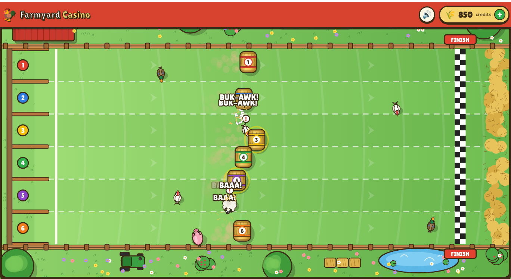

# Farmyard Casino 🐓🌾

A browser-based, cartoon farm-themed casino. All credits are **free play money** with no cash value.



## Games

### Hay Bale Derby (playable)
Six round hay bales roll down a hillside, seen from above. Back the bale you think will cross the
finish line first. Chickens, ducks, sheep, pigs and cows wander across the course at random and
bounce, slow down or divert any bale that hits them — the heavier the animal, the bigger the knock.

- **Odds** are priced fresh for every race by simulating the field 300 times (Monte Carlo) and
  applying a 10% house edge, so every bale returns roughly 90% on average. Odds range from ~1.5× to 60×.
- **Bale stats** (Speed, Kick, Steady) are shown on each card and genuinely drive the physics.
- The live race uses a seed drawn only when you press *Roll 'em!*, so the outcome can't be known
  while betting.
- Bets are win-only: payout = stake × odds, rounded down.


### Coming soon
Piggy Bank Slots, Egg Roulette, Cow Pat Bingo (placeholders in the lobby).

## Wallet
Click the credits pill in the top bar to add free credits (preset packs or a custom amount up to
100,000), see recent activity and reset the wallet. The balance and history are stored in
`localStorage` in your browser.

Bets are taken from the wallet when the race starts. If you leave the page or reload mid-race, the
race is replayed from its seed and settled, so a bet is never lost or left hanging.

## Running it
No build step and no dependencies. Either open `index.html` directly in a browser, or serve the
folder:

```sh
npm start        # serves on http://localhost:8080
```

## Tests
```sh
npm test         # Node 20+; covers the wallet and race simulation
```

## Code layout
| File | Purpose |
| --- | --- |
| `js/wallet.js` | Play-money wallet (deposit / spend / credit / history), persisted to localStorage |
| `js/rng.js` | Seeded PRNG so races are reproducible |
| `js/race-sim.js` | Pure, deterministic race physics, animal AI, collisions, odds and payouts |
| `js/race-render.js` | Canvas renderer: farm scenery, bales, animals, particles |
| `js/hay-derby.js` | Betting flow, race loop, results, crash recovery |
| `js/sound.js` | Synthesized sound effects (WebAudio) |
| `js/app.js` | Lobby, wallet modal, routing |
